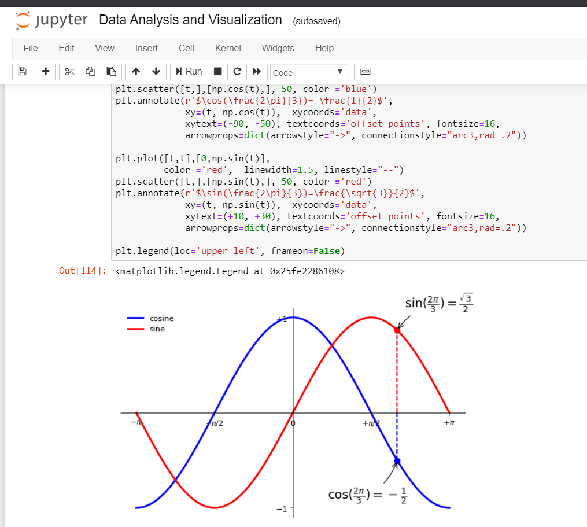
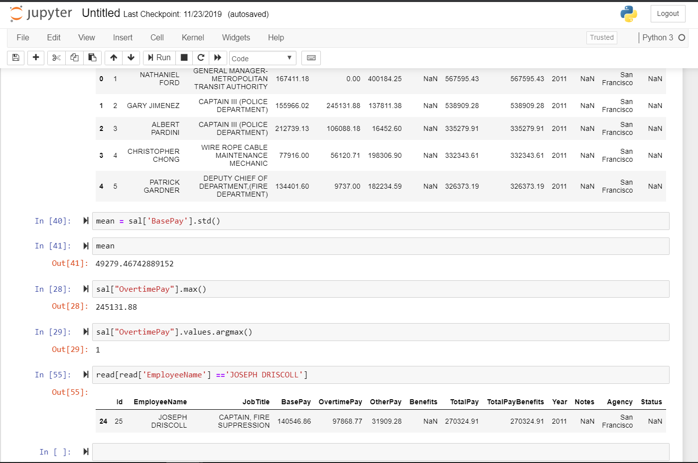

# #100DaysOfMLCode
>Features my daily progress on the 100DaysOfMLCode challenge on Twitter!!

## Day 1
Completed learning the basics of few Data Science libraries namely numpy, pandas, matplotlib , seaborn and was successfully able to implement them with  a few exercises by Jose Portilla. From tomorrow i'm going to focus mainly on ML. Let's see how it goes :)

Ps : I was busy contributing on an Open Source Project (Cleanpy) (which you can check out in my repo) causing a slight delay in updating the status.

  

## Day 2 & 3
Studied the univariate linear regression model and developed the intuition of how the gradient descent can used to solve any general hypothesis. And also got my linear algebra basics revised. Loving the Stanford's ML course on Coursera. Highly recommended for getting to know the mathematics behind ML !!

## Day 4
Learnt the normal equation method for solving linear regression models and also vectorisation of the Learning algorithms so as to efficiently implement in any programming Language. I also did learn the syntax and did few implementations of the algorithms in the Octave/ MATLAB programming language.

## Day 5
Finished reading the logistic regression and its vectorised implementation and also learnt how to to apply more advanced optimization algorithms like BFGS,L-BFGS in Octave. Also took time to develop the intuition of Neural networks.Today was so mentally exhausting. Still trying to digest the linear algebra of the sigmoid activation function of artificial neural network. Let's call it a day!!

## Day 6
Studied the regularization method to dilute the overfitting problem and also learned the forward and back propagation  algorithm in neural networks and how gradient descent is used to solve them. Still trying to digest the information crunch on theneural networks and its learning algorithms. Neural networks as of now seem to be slightly complicated.Today is'nt a productive day for me, but none is for everyone everyday right ??
Gonna try to gain a better intuition 'bout it tomorrow.
